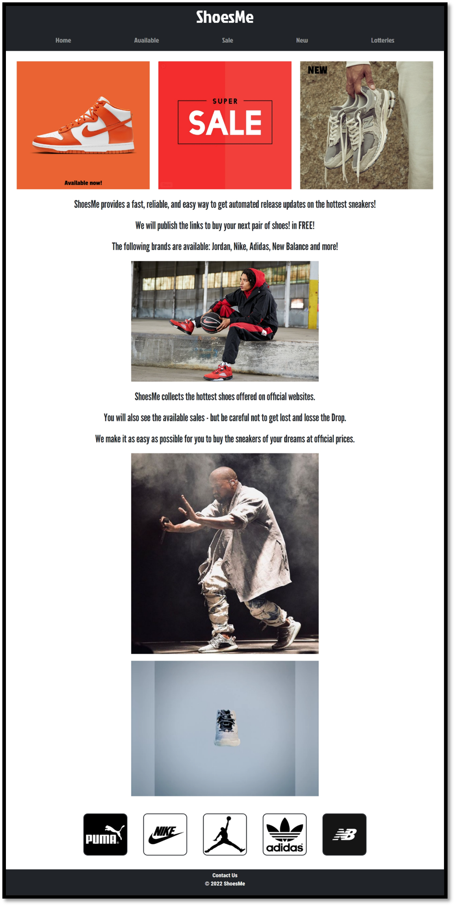
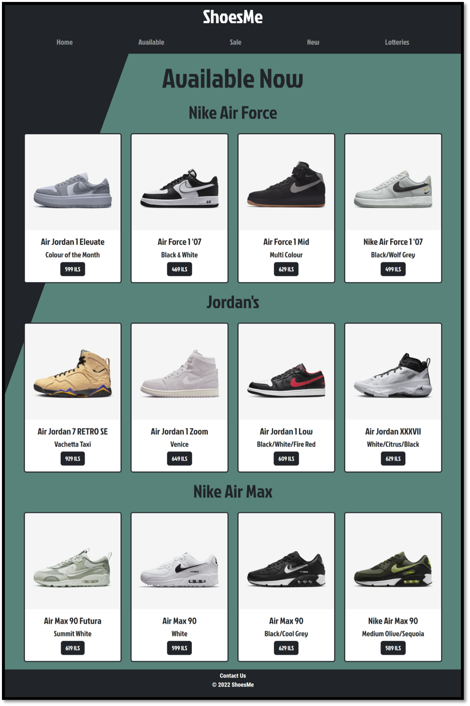
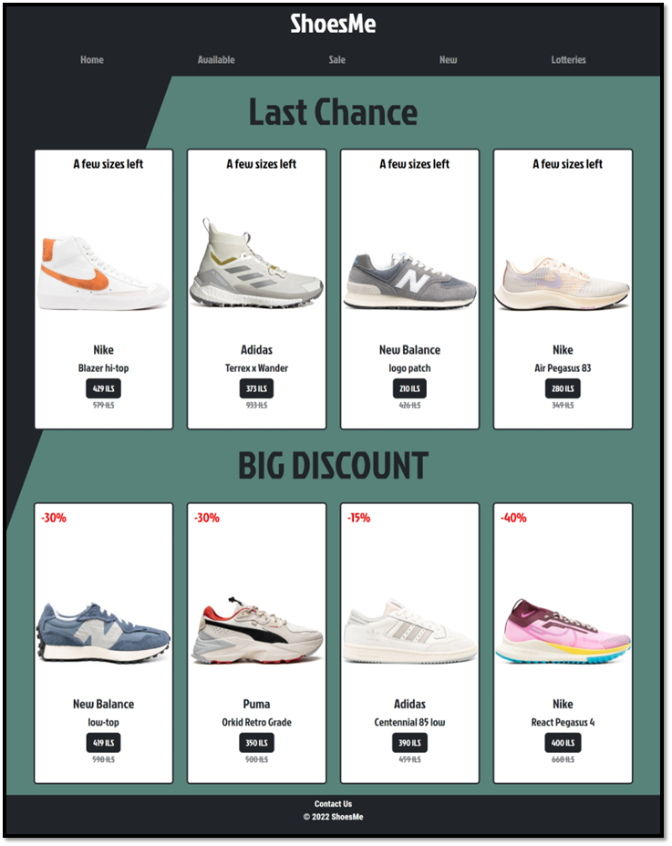
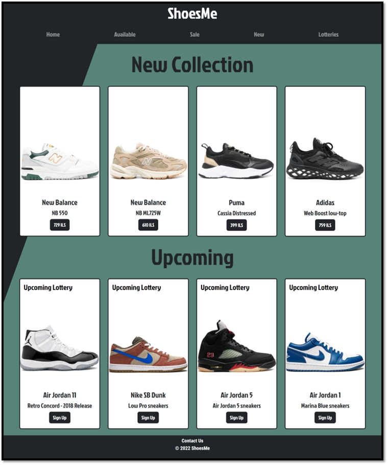
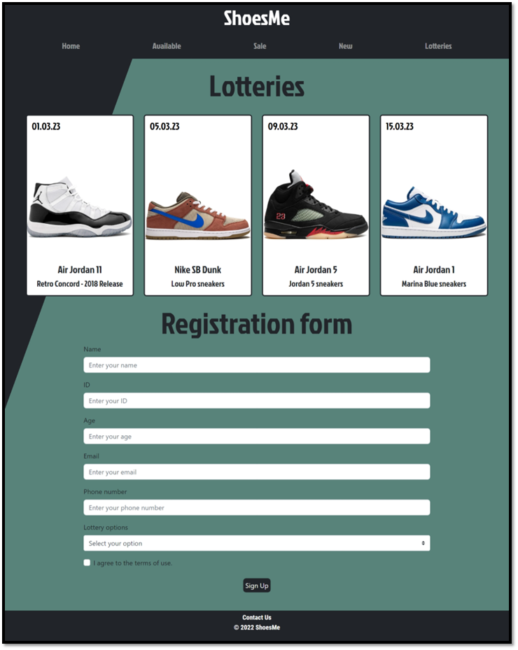

# ShoesMe

**The background of the program**

Welcome to our shoe site! This project was developed by a team consisting of myself and two other developers. Our site showcases the latest and most popular shoes on the market, along with links to leading online stores where they can be purchased.

We used a combination of HTML, CSS, JavaScript, PHP, and Bootstrap to create the various pages of the site. The home page features our vision for the project and includes jQuery functions to enhance the user experience. Other pages on the site highlight shoes that are currently on sale or newly released and available for purchase.

Please note that this website is a demo and is not updated in real time. The information and products displayed on the site may not reflect the current market or availability.

One unique feature of our site is the shoe lottery page, which allows users to register for a chance to win a free pair of shoes. To participate, users simply fill out a form and submit it to our secure cPanel server.

Link - http://itaype.mtacloud.co.il/

Thank you for visiting!

**Screens**

1) Home Page:

2) Availiable Page:

3) Sale Page:

4) New Page:

5) Lotteries Page:

